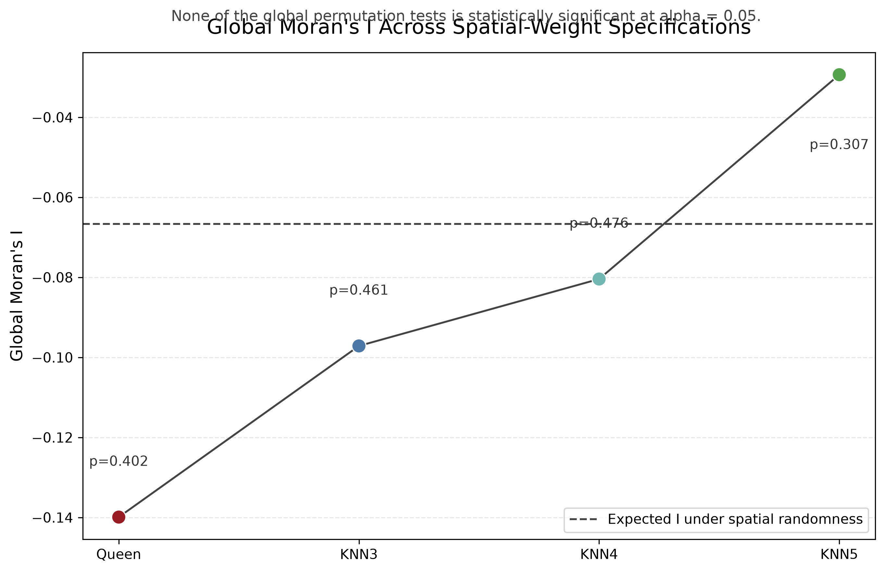
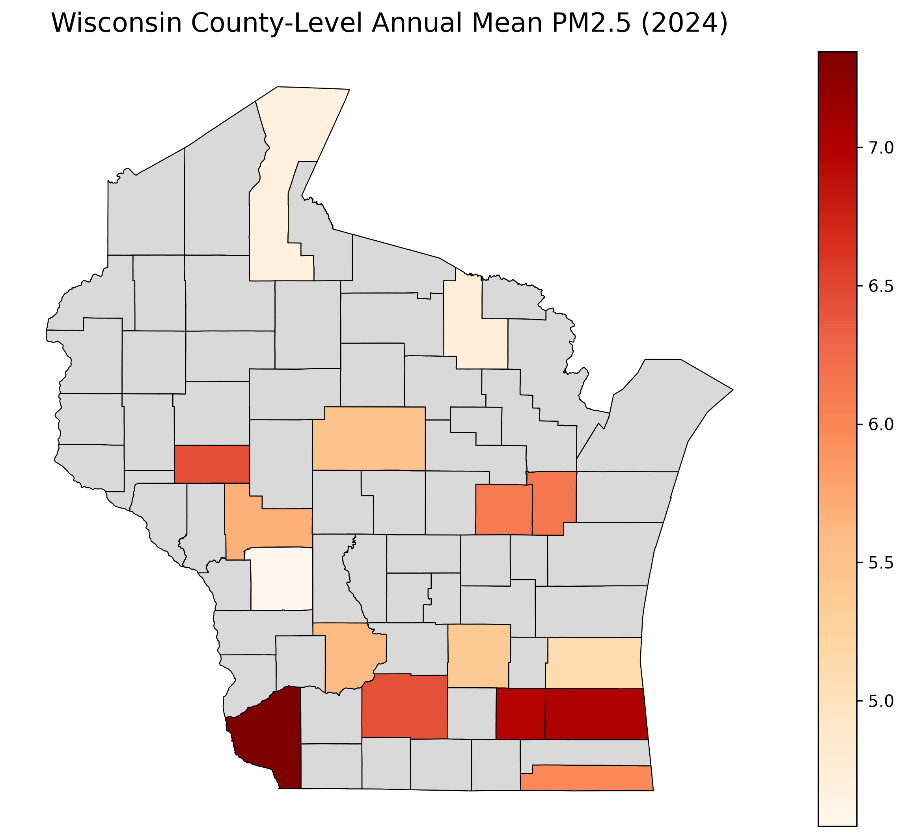
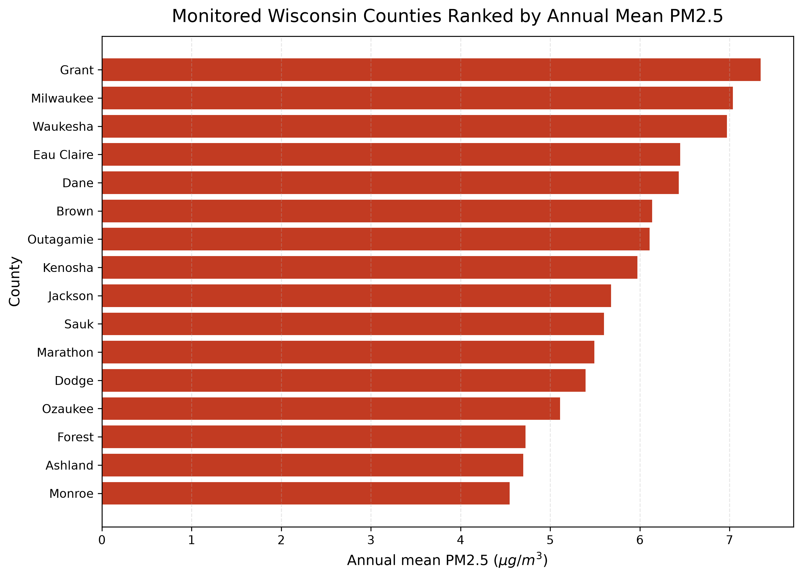
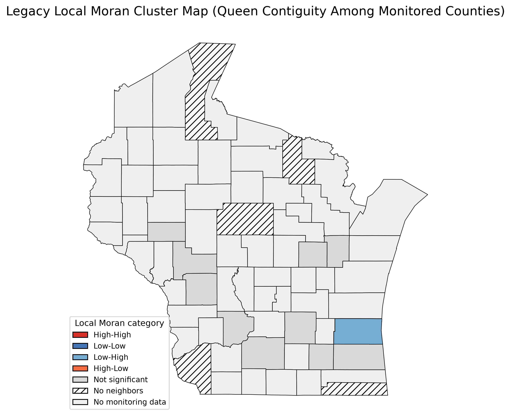

# Wisconsin PM2.5 Spatial Analysis

## Project Overview
This repository rebuilds the course project **Air Pollution Patterns in Wisconsin: A County-Level PM2.5 Spatial Analysis (2024)** in two layers:

1. `Legacy replication`
   Reconstructs the county-level PM2.5 tables, ranking chart, choropleth, and spatial autocorrelation workflow as faithfully as possible from the surviving materials.
2. `Portfolio-grade rebuild`
   Cleans the project structure, documents data provenance, adds tests, clarifies statistical caveats, and produces application-ready writing and slide artifacts.

Because the original raw EPA daily export and the original class notebook were not available in the supplied files, this rebuild uses a transparent fallback county snapshot for the replication layer and states that limitation clearly throughout the project.

## Research Questions
- Which monitored Wisconsin counties had the highest and lowest descriptive annual mean PM2.5 values in 2024?
- How much of the state is unmonitored at the county level in the legacy project setup?
- Does county-level PM2.5 among monitored counties show robust spatial clustering?

## Data Sources
- EPA Air Trends county page: [Air Quality - Cities and Counties](https://www.epa.gov/air-trends/air-quality-cities-and-counties)
- EPA AirData download catalog: [Pre-Generated Data Files](https://aqs.epa.gov/aqsweb/airdata/download_files.html)
- Wisconsin county boundaries: [GeoData@Wisconsin county layer](https://geodata.wisc.edu/catalog/604F7A0B-1715-43B8-835E-4032851481AD)
- Population context: supplied `ctyfactbook2024_0.xlsx` and `Wisconsin_PM25_simplified.xlsx`, both tied to the `Population (2020 Census)` field
- Official Census reference page used for documentation: [County Population Totals and Components of Change](https://www.census.gov/data/tables/time-series/demo/popest/2020s-counties-total.html)

## Directory Structure
```text
wisconsin-pm25-spatial-analysis/
├── README.md
├── LICENSE_OR_DATA_NOTICE.md
├── DATA_GAPS.md
├── requirements.txt
├── environment.yml
├── Makefile
├── .gitignore
├── data/
│   ├── raw/
│   ├── interim/
│   └── processed/
├── notebooks/
│   ├── 00_legacy_replication.ipynb
│   └── 01_portfolio_analysis.ipynb
├── src/
├── tests/
├── outputs/
│   ├── figures/
│   ├── tables/
│   └── logs/
├── reports/
└── slides/
```

## Environment Setup
```bash
python3 -m venv .venv
.venv/bin/pip install -r requirements.txt
```

## One-Command Reproduction
```bash
make all
```

Useful partial targets:
- `make analysis`
- `make notebook`
- `make test`
- `make slides`
- `make report`

## Expected Outputs
- `outputs/tables/county_annual_pm25.csv`
- `outputs/tables/wisconsin_counties_pm25_joined.geojson`
- `outputs/figures/pm25_2024_choropleth.png`
- `outputs/figures/pm25_2024_ranked_bar.png`
- `outputs/figures/global_moran_sensitivity.png`
- `outputs/figures/lisa_cluster_map_legacy.png`
- `outputs/figures/lisa_cluster_map_knn4.png`
- `outputs/figures/lisa_weights_comparison.png`
- `outputs/figures/pm25_vs_population_density.png`
- `outputs/tables/spatial_weights_comparison.csv`
- `outputs/tables/local_cluster_stability.csv`
- `outputs/logs/VALIDATION_REPORT.md`
- `reports/Wisconsin_PM25_Writing_Sample_2to3_pages.docx`
- `reports/Wisconsin_PM25_Writing_Sample_2to3_pages.pdf`
- `slides/Wisconsin_PM25_Spatial_Analysis.pptx`
- `slides/Wisconsin_PM25_Spatial_Analysis.pdf`

## Data Limitations
- Only 16 of Wisconsin's 72 counties carry PM2.5 values in the legacy benchmark snapshot.
- Unmonitored counties remain missing on the statewide map by design.
- The project uses descriptive annual means, not EPA regulatory design values.
- The legacy Queen contiguity graph among monitored counties is disconnected and contains islands.
- Raw-record-level replication could not be completed because the original daily EPA export was absent and direct retrieval failed in this workspace.

## Legacy Versus Corrected Analysis
- `Legacy replication` keeps the original county benchmark targets and the Queen-based spatial setup, including its disconnected topology.
- `Corrected analysis` preserves the legacy Queen result but adds KNN sensitivity specifications with `k = 3`, `4`, and `5` so the spatial conclusions can be checked against alternative neighborhood definitions.

## Spatial-Weights Sensitivity Results

| Specification | Moran's I | p-value | Components | Islands |
| --- | --- | --- | --- | --- |
| Queen | -0.139923 | 0.402 | 8 | 5 |
| KNN3 | -0.097149 | 0.461 | 1 | 0 |
| KNN4 | -0.080429 | 0.476 | 1 | 0 |
| KNN5 | -0.029374 | 0.307 | 1 | 0 |

Queen contiguity reflects literal shared boundaries, but it becomes problematic when the analysis is restricted to sparsely monitored counties because the monitored-only graph fragments into eight connected components and leaves five island counties. KNN connects every monitored county to a fixed number of geographically nearest monitored counties and is used here as a robustness specification rather than as an objectively correct replacement.

The absence of significant global autocorrelation is robust across all tested specifications. Individual LISA cluster labels are not robust: Ozaukee appears as `Low-High` under Queen and KNN3 but disappears under KNN4 and KNN5, while Ashland appears as `Low-Low` only under KNN5. KNN does not repair the underlying lack of monitoring coverage, and the inference remains restricted to the 16 monitored counties represented in the descriptive county snapshot used in this project.



## My Contribution
**Yifang Qiu**: analysis, spatial joining, choropleth mapping, county ranking, Global Moran's I, Local Moran's I, and visualization.

## Figure Preview






## Reproducibility Notes
- No legacy Colab root paths are used in the final source.
- All paths are relative and built from `pathlib.Path`.
- The notebooks are generated and executed by the local project pipeline rather than relying on an external classroom environment.
